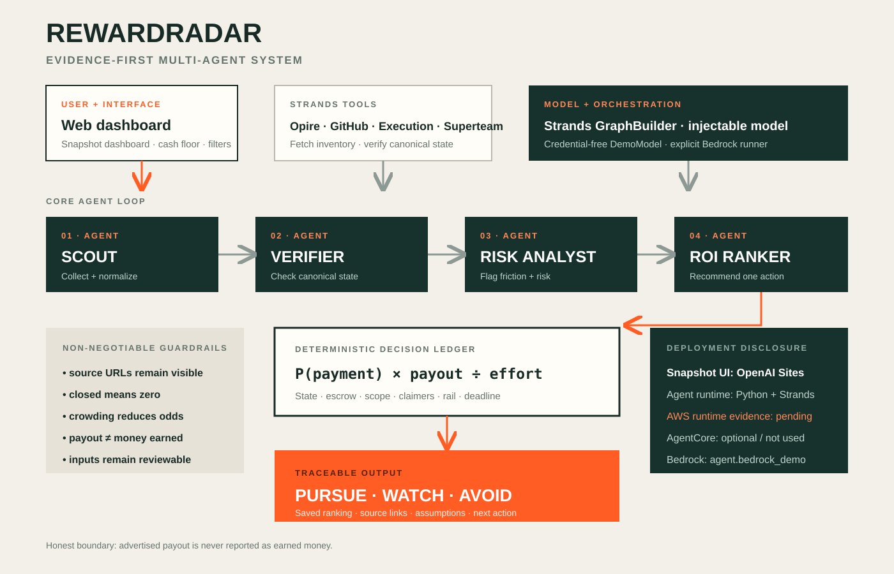

# RewardRadar

**Stop chasing phantom bounties.** RewardRadar is a Strands multi-agent system that audits paid technical opportunities before a contributor commits scarce time. It cross-checks marketplace claims against canonical sources, identifies payment and competition risk, and ranks only the opportunities that survive by expected return.

Built for the **Professional Agents** track of the 2026 Agents for Humans hackathon.

## Why this exists

A bounty feed is not a source of truth. In the time-stamped evidence snapshot captured on September 10, 2026, repository capture scripts examined 30 advertised Opire reward rows. Only eight resolved to GitHub issues that were still open; several of the largest headline amounts were locked, crowded, or otherwise implausible. At the same instant, a second marketplace exposed 26 published tasks worth only **$1.78 in total**—real work, but irrelevant to a $100 objective.

A September 11 refresh reproduced the core result: 30 advertised Opire rows, only eight canonical issues still open, and 22 closed, deleted, or unverifiable rows. One seemingly conventional $1,500 reward with zero visible solvers pointed to a GitHub issue that returned HTTP 410; an even larger displayed outlier was canonically closed. The separate microtask inventory had contracted to seven published rows worth **$1.60 in total**. A separate Superteam sweep found one open, agent-eligible competition with a $100 individual prize floor, then exposed the requirements hidden behind that headline: a public X post, at least five Solana-mainnet trades, direct sponsor payment, and a sponsor that the listing API did not mark verified. The listing's structured deadline also differed from its written closing date. The raw snapshots are committed in `data/audit-2026-09-10.json`, `data/audit-2026-09-11.json`, and `data/superteam-audit-2026-09-10.json`.

RewardRadar turns that noisy inventory into one defensible decision. It never equates “advertised” with “earned.”

## What makes the agent useful

- **Evidence before synthesis.** GitHub issue state, lock state, claim count, payout rail, and acceptance criteria are deterministic inputs.
- **Specialist graph.** Scout → Verifier → Risk Analyst → ROI Ranker is implemented as a four-node `strands.multiagent.GraphBuilder` graph.
- **Deterministic formulas.** Expected-value arithmetic and verdict thresholds live in unit-tested Python. Evidence fields and base probabilities remain explicit inputs that must be reviewed.
- **Honest uncertainty.** Every result separates payout, probability, effort, confidence, and risk signals.
- **Two explicit execution modes.** A deterministic demo model exercises the real Strands graph in CI, while `agent.bedrock_demo` runs the same graph against Amazon Bedrock through the standard AWS credential chain.

## Architecture



The product deliberately splits responsibilities:

1. **Scout** calls source adapters and normalizes inventories.
2. **Verifier** checks canonical issue/task state instead of trusting labels.
3. **Risk Analyst** measures escrow, sponsor, payout-rail, scope, crowding, activity, and deadline risk.
4. **ROI Ranker** applies the deterministic score and emits `pursue`, `watch`, or `avoid` with cited evidence.

## Run locally

### Agent

```bash
python -m venv .venv
.venv/Scripts/pip install -r requirements.txt
.venv/Scripts/python -m agent.demo
.venv/Scripts/python -m unittest discover -s tests -v
.venv/Scripts/python scripts/capture-live-audit.py data/audit-latest.json
.venv/Scripts/python scripts/capture-superteam-audit.py data/superteam-audit-latest.json
.venv/Scripts/python scripts/phone-verifier.py data/demo_phone_verification.json
```

On macOS/Linux, replace `.venv/Scripts/` with `.venv/bin/`.

`agent.demo` ranks a checked-in fixture and executes the four-node Strands graph with one prescribed `DemoModel` tool call per node. It proves graph and tool execution, not live retrieval or open-ended model reasoning. To connect a hosted model, import `create_specialist_graph(model=...)` from `agent.orchestrator` or use the explicit Bedrock command below.

### Amazon Bedrock run

After configuring an AWS account and least-privilege credentials that may invoke the selected Bedrock model:

```bash
.venv/Scripts/pip install -r requirements.txt
.venv/Scripts/python -m agent.bedrock_demo
```

The dependency is pinned to the tested Strands Agents SDK 1.55.1. The default is `global.anthropic.claude-sonnet-4-6`, the current Strands default documented for Bedrock. Override it with `--model-id` or `REWARDRADAR_BEDROCK_MODEL_ID`, and select a region with `--region` or the normal AWS SDK settings. The runner exposes no credential flags or credential files; authentication is delegated to boto3’s standard credential chain. The selected model must be enabled, and the AWS principal needs `bedrock:InvokeModel` and `bedrock:InvokeModelWithResponseStream`. A Bedrock invocation can incur AWS charges.

The hosted-model proof uses `fixture_only=True`, which exposes exactly one checked-in-data tool to each specialist and avoids variable marketplace requests. It prints `BEDROCK RUN COMPLETED`, node order, and token usage only when Strands reports `Status.COMPLETED`; otherwise the command fails.

### Optional CALL-E verification extension

For a high-value candidate with an explicitly authorized contact, RewardRadar can prepare one structured phone-verification intent. Install the optional pinned SDK with `pip install -r requirements-calle.txt`, then run the command above to see a **network-free preview**. The committed example uses a reserved fictional number that the live path permanently refuses to call.

The preview masks the destination, discloses the AI caller, fixes the allowed questions, uses an intent-bound idempotency key, and requires the exact `PLACE_ONE_CALL` gate before the SDK can place one call. Even a completed call is only a lead: `reconcile_call` keeps `payout_verified=false` until the returned HTTPS source is checked independently. No live CALL-E call or contest eligibility is claimed in v0.2.

### Alexa+ MCP prototype

The repository includes a credential-free self-hosted MCP endpoint for the
Alexa+ track. Run `python -m agent.alexa_mcp_server --port 8787` and send
JSON-RPC requests to `POST /mcp`. It exposes the evidence-first RewardRadar
fixture via `search_rewards`, `verify_funding`, and
`summarize_submission_status`; see `docs/ALEXA_PLUS.md`. The prototype is
explicitly fixture-only and does not claim a live Alexa+ integration or a prize.
A short English walkthrough is committed at
[`public/media/AlexaPlus-demo-draft.mp4`](public/media/AlexaPlus-demo-draft.mp4).

### Dashboard

```bash
pnpm install
pnpm dev
```

Open `http://localhost:5173`. Row selection and filters are interactive. The replay control animates a saved UI trace; it does not refresh sources or invoke the Python agent. Run the capture scripts for fresh network evidence.

### Static public deployment

The repository also contains a least-privilege GitHub Pages workflow. It sets `REWARDRADAR_STATIC_EXPORT=1`, runs the official Next.js static export, and deploys only `out/`. The normal `pnpm build` command remains the Vinext/Sites build, so this fallback does not change that runtime. Once Pages is enabled with **GitHub Actions** as its source, the expected public URL is `https://cuentapraces07-ops.github.io/rewardradar/`.

## Repository map

```text
agent/
  core.py          deterministic scoring and verdicts
  phone_verifier.py safe CALL-E preview, execution gate, and fail-closed reconciliation
  tools.py         Strands tools for Opire, Execution Market, Superteam, and GitHub
  orchestrator.py  single-agent entry point and four-node specialist graph
  demo_model.py    zero-credential model adapter for a reproducible graph run
  demo.py          end-to-end fixture demo
  bedrock_demo.py  explicit hosted-model run through Amazon Bedrock
app/               interactive dashboard
data/              transparent demonstration inputs
docs/              architecture and submission assets
submission/        video narration and three builder.aws bonus-post drafts
tests/             scoring guardrail tests
public/media/      public English Alexa+ walkthrough draft
SUBMISSION_CHECKLIST.md  rule-by-rule readiness register
DISCLOSURES.md           AI assistance and dependency disclosure
```

## Live source adapters

- Opire rewards: `https://api.opire.dev/rewards`
- Execution Market: `https://api.execution.market/api/v1/tasks?status=published&limit=100`
- Superteam agent-eligible listings: `https://superteam.fun/api/listings?take=100`
- Superteam canonical listing details: `https://superteam.fun/api/listings/details/{slug}`
- GitHub canonical verification: `https://api.github.com/repos/{owner}/{repo}/issues/{number}`

The adapters use public endpoints and identify the client with a user agent. No personal account, social profile, or private repository is required to run an audit.

The optional phone-verification adapter uses `calle-ai==0.7.0`, the latest PyPI release verified on September 10, 2026. It requires a user-supplied, authorized destination and `CALLE_API_KEY` only at live execution time; neither is stored in the repository.

## Hackathon compliance and deployment disclosure

- The four specialist nodes and tool handoffs execute through the Strands Agents SDK; `python -m agent.demo` prints the tool ledger.
- The repository is MIT-licensed and includes source, tests, an architecture diagram, submission copy, narration, and a reproducible video generator.
- Three distinct, source-backed builder.aws drafts are included for the optional bonus. They are drafts, not claimed as published posts.
- The OpenAI Sites deployment is an owner-private hosted snapshot. A GitHub Pages static-export workflow provides the public fallback; live-source capture and the Python agent runtime remain separate CLI processes.
- **AWS runtime evidence captured so far: none.** The repository includes an explicit Amazon Bedrock entry point, but neither a completed Bedrock invocation nor an AgentCore deployment is claimed until its output is recorded.
- `DemoModel` is a deterministic, credential-free adapter for reproduction. It does not pretend to be a hosted foundation model.
- AI-assisted development and all pre-existing/reused components must be disclosed in the final Devpost entry.

## Safety and transparency

RewardRadar does not guarantee a prize or payout. It does not fabricate identities, eligibility, work history, acceptance evidence, or source state. Marketplace amounts may be non-escrowed; the tool keeps that distinction visible. Any step that creates an external account, submits work, accepts terms, or configures a payment destination remains an explicit owner action.

## Status

- [x] Live market evidence collected
- [x] Strands tools and specialist graph implemented
- [x] Deterministic scoring guardrails tested
- [x] Interactive dashboard implemented
- [x] Architecture, narration, and sub-five-minute demo video prepared
- [x] Time-stamped raw evidence snapshot committed
- [x] Three optional builder.aws bonus-post drafts prepared
- [x] GitHub Pages static-export fallback implemented and locally tested
- [x] Public GitHub repository ([cuentapraces07-ops/rewardradar](https://github.com/cuentapraces07-ops/rewardradar))
- [ ] Devpost submission (requires owner identity and final submit authorization)
- [ ] Payout destination (required only if an award is issued)

## License

MIT — see [LICENSE](LICENSE).
